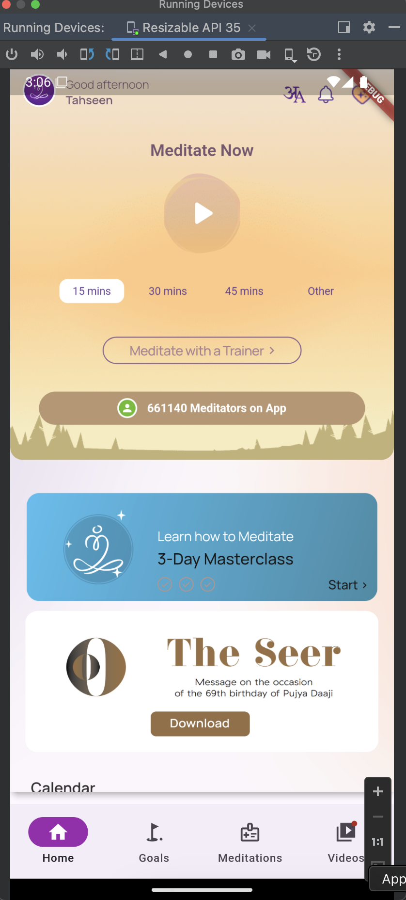
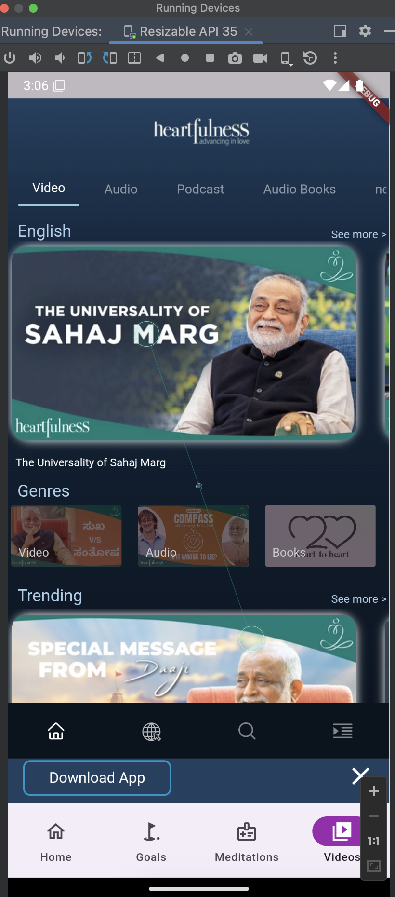

# heartfulness
> This guide provides an overview of the **Heartfulness Flutter Application**, showcasing the integration of Mogiiodotcom's platform using the `inappwebview` SDK.


## Installation

### Prerequisites
- Ensure that you have the Flutter development environment set up by following the [official Flutter installation guide](https://docs.flutter.dev/get-started/install).

After setup, run the following command to verify your environment:
```sh
flutter doctor -v
```

To begin, clone the Heartfulness sample repository and navigate into the project directory:
```sh
git clone https://github.com/ramanmmm/flutter-sso-with-react-native.git
cd flutter-sso-with-react-native 
```

Install the necessary Flutter packages by running:
```sh
flutter pub get
flutter run
```

## InAppWebView Integration
For the main webview integration using InAppWebView, refer to the function found in the main file:
[#lib/main.dart#60L](https://github.com/mogiiodotcom/heartfulness.org-sample/blob/1d88268b6e2f1da7ff958935664a7489cc270b4b/lib/main.dart#L60)

## Sceenshots
Home Section             |  Video Section
:-------------------------:|:-------------------------:
  |  

This documentation provides a quick overview of setting up the Heartfulness Flutter Application along with the InAppWebView integration.
